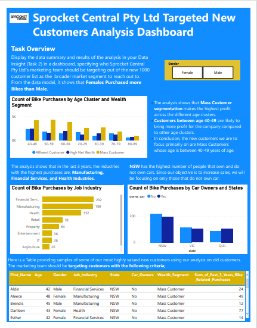

# KPMG-Data-Analytics-Consulting-Virtual-Internship

## Task Accomplishments

## Table of contents

- [Overview](#Overview)
- [Task 1](#Task-1)
- [Task 2](#Task-2)
- [Task 3](#Task-3)
- [Impact and Results](#Impact-and-Results)
- [Skills Utilized](#Skills-Utilized)
- [Dashboard View](#Dashboard-View)

## Overview

The KPMG Data Analytics Consulting Virtual Program provided intensive training and hands-on experience in applying data analytics techniques to real-world business scenarios. The program focused on enhancing skills in data analysis, data visualization, and utilizing various tools and software for data-driven decision-making.

## Task 1

### Data Quality Exploration

- Conducted an extensive exploration of the dataset to identify and assess data quality issues.
- Utilized Microsoft Excel to extract, clean, and transform data, ensuring consistency and accuracy.
- Employed data profiling techniques to identify missing values, outliers, and inconsistencies within the dataset.
- Developed data quality improvement strategies, including data standardization and validation processes.
- Finally drafted an email on Microsoft Word to the client identifying all data quality issues.

## Task 2

### PowerPoint Presentation - Identifying Target Customers for Sprocket Central Pty Ltd

- Prepared a comprehensive PowerPoint presentation outlining the approach to identify the target customers from a dataset of 1000 customers for Sprocket Central Pty Ltd.
- Divided the approach into three phases: 
  - #### Data Exploration
    Conducted thorough data exploration to understand the dataset, including analyzing customer demographics, purchasing behavior, and historical data.
  - #### Model Development
    Utilized various data analysis techniques, such as clustering or classification algorithms, to develop customer segmentation models or predictive models.
  - #### Interpretation
    Interpreted the results of the models, extracting meaningful insights and identifying key customer segments or specific customer attributes that make them ideal targets for Sprocket Central Pty Ltd.
- Supported the presentation with visually compelling charts, graphs, and data visualizations to communicate insights effectively.

## Task 3

- Developed a comprehensive dashboard using Power BI to present the data summary and results of the analysis to the client.
- Included key metrics, customer segmentation insights, and recommendations in the dashboard for the client's understanding.
- Visualized the customer data, highlighting important characteristics and attributes that indicate potential target customers from the new 1000-customer list for Sprocket Central Pty Ltd.

### Impact and Results

- Successfully developed an interactive and visually appealing dashboard for presenting data summary and analysis results to the client.
- Provided the client with a clear understanding of the target customers for Sprocket Central Pty Ltd based on the analysis of the new 1000-customer list.
- The dashboard was informative and visually engaging, aiding in data-driven decision-making.
 
### Skills Utilized

 - Data analysis
 - Data visualization
 - Dashboard development
 - Microsoft Power Bi
 - Microsoft Word
 - Microsoft Excel
 - PowerPoint presentation
 - Customer segmentation
 - Data interpretation
 
 ### Dashboard View

